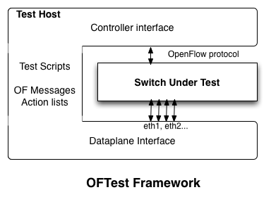

OFTest OpenFlow Testing Framework

---

# Introduction

OFTest is a Python based OpenFlow switch test framework and collection of test cases. It is based on unittest, which is included in the standard Python distribution.

This document is meant to provide an introduction to the framework, discuss the basics of running tests and to provide examples of how to add tests.

For information on writing new tests or making improvements to the test framework see the file [DEVELOPING](DEVELOPING.md).

---

# How It Works

OFTest is meant to exercise a candidate OpenFlow switch (henceforth the device under test (DUT) or switch under test (SUT)). Below is the "horseshoe" disagram for OFTest that demonstrates the interaction between OFTest and SUT.

As you can see, the SUT is in the middle. The test fixture, the OFTest server, connects to both the control plane and the data plane of the SUT. It coordinates OpenFlow commands with data plane stimulus and monitoring.

Some additional info on OFTest:

 * OFTests starts with the very basics of OpenFlow, but provides a framework for development of more complicated tests.
 * It was used as the primary vehicle for validating OpenFlow 1.1 (see the `oft-1.1` branch in the Git repository).
 * A prototype implementation of an OpenFlow 1.1 switch, OFPS, was implemented in the same framework as OFTest (also in the `oft-1.1` branch).

---

# Getting OFTest

You can check out OFTest with git with the following command:

    git clone git://github.com/floodlight/oftest

---

# Quick Start

You need to have Python and Scapy installed on your system. See 'Pre-requisites' below.

Make sure your switch is running and trying to connect to a controller on the machine where you're running oft (normally port `6653`).

    cd oftest
    ./oft --list
    sudo ./oft basic.Echo
    sudo ./oft --verbose --log-file=""
    sudo ./oft basic -i 1@veth1 -i 2@veth3

---

# Extending OFTest

We welcome any kind of patch. Send all patches as pull requests to `floodlight/oftest`. We recommend you check out the [CONTRIBUTING.md] document for ideas and requirements around patches.

---

# Longer Start

## Configure Pre-requisites

The following software is required to run OFTest:

 * Python 2.7
 * Scapy
 * pypcap (optional - VLAN tests will fail without this)
 * tcpdump (optional - Scapy will complain if it's missing)
 * Doxygen and doxypy (optional - for documentation generation)
 * PyLint (optional - for source checking)

Most of these can be installed using your package manager. For example:

    sudo yum install python  # for RHEL-based distros
    sudo apt-get install scapy  # for Debian-based distros

You will also need an OpenFlow-compliant switch instance to test. This switch must be running OpenFlow 1.0+ and attempting to connect to a controller on the machine running `oft`.

Finally root/sudo privilege is required on the host, in order to run `oft`.

## Start the Switch

The switch must be running and actively attempting to connect to a controller on the test host at the port number used by oft (`6653` by default, or specified as `--port=<n>` as an argument to oft).

If you're new to the test environment and want to check its sanity, you can do the following. This requires that your host kernel supports virtual Ethernet interfaces. This is best done in a window separate from where you will run oft.

 1. Check out OpenFlow (preferably at the same level as oftest):

        git clone git://openflowswitch.org/openflow.git

 2. Build OpenFlow:

        cd openflow
        ./boot.sh
        ./configure; make
        cd ../oftest

 4. Run the switch startup script:

        sudo ./run_switch.py

## Run OFTest

Now you can run `oft` (see below). Use `--help` to see command line switches.

    cd <oftest>
    sudo ./oft --help

If you use a port number other than the default, make sure you use the same one for the switch as for oft. For example, to run the `basic` collection of tests:

    sudo ./oft basic -i 1@veth1 -i 2@veth3

Once you're finished, use `Ctrl-C` to terminate the switch daemons. To clean up the virtual ethernet interfaces, use:

    sudo rmmod veth

New tools allow you to run an OVS instance as well. See `oftest/tools/ovs-ctl`. You will need to install a version of [Open vSwitch](http://openvswitch.org/) for this to work.

---

# Configuring OFTest

## Platforms

The "platform" is a configuration file (written in Python) that tells OFTest how to send packets to and receive packets from the dataplane of the switch.

### `eth`

The default platform, `eth`, uses Linux Ethernet interfaces and is configured with the `-i` option (or `--interface`). Pass the option as `-i ofport@interface`, for example `-i 1@eth1`. If no `-i` options are given the the default configuration uses vEths for backwards-compatibility with the original OpenFlow reference switch.

### `remote`

Another common platform, `remote`, provides support for testing of switches on a different host. This can be useful for cases where interfaces are not available on one host (i.e. they're not bound to a Linux interface driver) or where OFTest cannot run on the same host (unsupported OS, missing software, etc.).

This can be enable by modifying the `platforms/remote.py` file to point to 4 NICs on the host running OFTest, like so:

    remote_port_map = {
        23 : "eth2", # OpenFlow port 23 of the switch is connected to physical port on the server eth2
        24 : "eth3", # OpenFlow port 24 of the switch is connected to physical port on the server eth3
        25 : "eth4",
        26 : "eth5"
    }

## Passing Parameters to Tests

There is a facility for passing test-specific parameters into tests that works as follows. On the command line, give the parameter

    --test-params="key1=17;key2=True"

Currently the keys used control whether VLAN tagged packets are used and whether VLAN tag stripping should be included as an action. These parameters include:

    vid=N: Use tagged packets with VLAN id of N
    strip_vlan=bool: If True, add the strip VLAN tag action to the packet test

---
